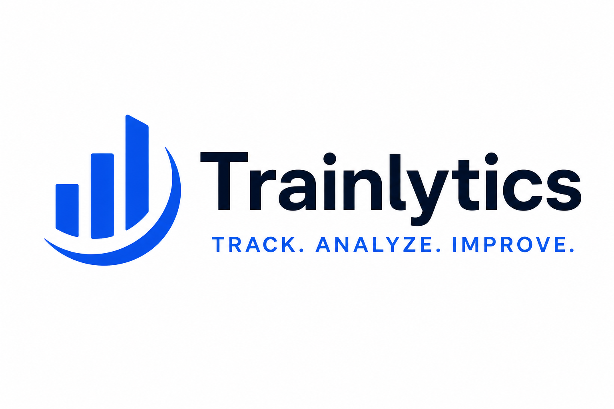

# Trainlytics
<p align="center">
  
</p>

A personal fitness tracking app built for people who want more control, flexibility, and insights than standard fitness apps provide.

Most fitness tools are optimized for a single activity (running, gym, yoga) and make hybrid training difficult to track. Fitness Tracker solves this by providing one customizable place to plan, log, analyze, and review all fitness progress.

---

## Problem

Existing fitness apps are often too rigid:
- Running apps lack detailed strength tracking
- Gym apps ignore cardio metrics like pace or heart rate zones
- Planning and progress analysis are fragmented across multiple tools
- Sharing progress for coaching or AI analysis is inconvenient

Users need one system that adapts to their training style instead of forcing them into predefined workflows.

---

## Solution

Fitness Tracker is a highly customizable fitness dashboard that supports multiple training styles and detailed progress tracking.

Users can:

- Log cardio activities with detailed metrics such as duration, distance, pace, heart rate, and pulse zones
- Log strength sessions with full workout breakdown:
  - exercises
  - sets
  - reps
  - weights
  - progression over time
- Save reusable workout templates for recurring strength sessions
- Build and manage weekly training plans
- Compare planned vs completed workouts
- Track progress through analytical charts and long-term trends
- Export weekly summaries in structured text format for sharing or AI-powered analysis

---

## Deployment: Running locally

**Prerequisites:** Docker and Docker Compose installed.

**1. Create a `.env` file** in the repo root:

```
SECRET_KEY=<a long random string>
USERS=<username>:<bcrypt_hash>
```

To generate a bcrypt hash for a password, run:

```bash
docker compose run --rm backend uv run python -c \
  "import bcrypt; print(bcrypt.hashpw(b'yourpassword', bcrypt.gensalt()).decode())"
```

Example `.env`:
```
SECRET_KEY=super-secret-dev-key-change-in-production
USERS=alice:$2b$12$...
```

Multiple accounts are supported — separate them with commas:
```
USERS=alice:$2b$12$...,bob:$2b$12$...
```

**2. Start all containers:**

```bash
docker compose up --build
```

**3. Run database migrations** (only needed on first start or after schema changes):

```bash
docker compose exec backend uv run alembic upgrade head
```

**4. Open the app** at [http://localhost:5173](http://localhost:5173) and log in with the credentials from your `.env`.


